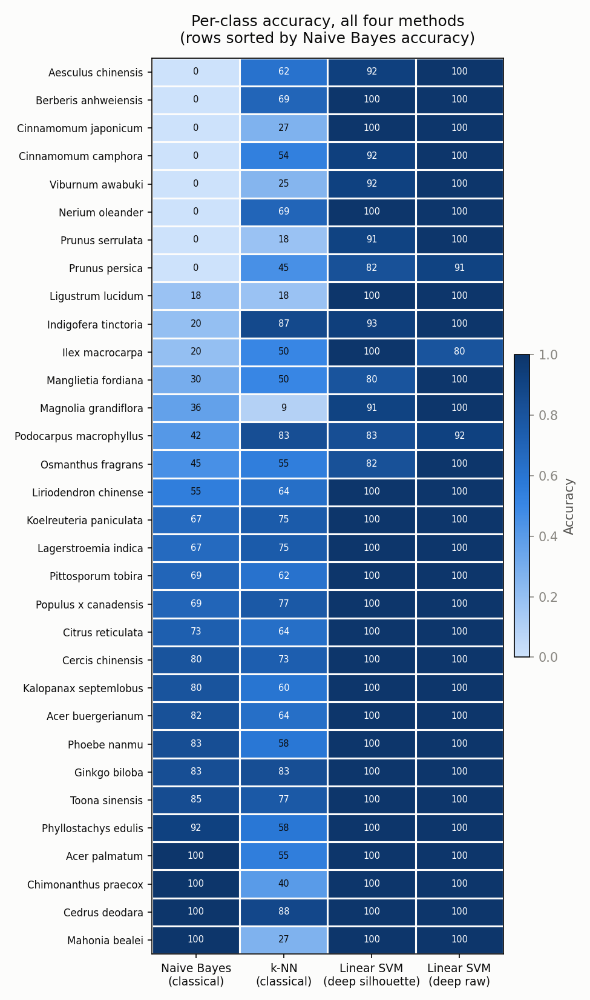

# Leaf Species Recognition (Flavia)

Automatic Image Analysis, Project A. We classify a single leaf into one of 32
Flavia species and ask **how far shape alone can go, and when learned image
features add value**. Two pipelines are compared on one shared train/test split:

- **Classical (shape only):** 7 Hu moments + 16 Fourier descriptors of the
  silhouette, classified with k-NN and Gaussian naive Bayes.
- **Deep (learned features):** frozen MobileNetV2 as a feature extractor + a
  linear SVM, run on the silhouette (learned shape) and on the raw colour image.

The extended written discussion is in [`results/report.md`](results/report.md).

## Results at a glance

All methods use the identical stratified 80/20 split (1,525 train / 382 test,
seed 42). Chance level for 32 classes is about 3.1%.

| Method | Input | Accuracy |
|---|---|---|
| Naive Bayes | classical (shape) | 50.0% |
| k-NN | classical (shape) | 58.4% |
| Linear SVM | deep, silhouette | 96.3% |
| Linear SVM | deep, raw image | **99.0%** |

Per-class accuracy for all four methods (rows sorted by naive Bayes accuracy):
classical accuracy is bimodal (near 0% or near 100%), while the deep columns are
near-uniformly high.



## Repository structure

```
data/
  raw/                 # 1,907 Flavia .jpg images (input)
  processed/           # silhouettes, split.json, feature CSVs (generated)
scripts/               # the pipeline (run from inside this folder)
results/
  figures/             # confusion matrices, heatmap, example leaves, ...
  tables/              # model_comparison.csv, per-class CSVs, predictions
  report.md            # extended written discussion
notebooks/
  results_walkthrough.ipynb   # visual tour of the generated results
```

## Setup

Python 3.10+ recommended.

```bash
pip install -r requirements.txt
```

`requirements.txt` includes numpy, opencv-python, scikit-image, scikit-learn,
matplotlib, jupyter and tensorflow==2.16.2 (TensorFlow is only needed for the
deep pipeline).

## Reproduce the results

The scripts use relative paths, so **run them from inside the `scripts/`
folder**, in this order:

```bash
cd scripts

python make_split.py            # 1. build the shared train/test split -> data/processed/split.json
python preprocess.py            # 2. raw images -> binary silhouettes
python extract_features.py      # 3. classical features (Hu + Fourier) -> classical_features.csv
python extract_deep_features.py # 4. MobileNetV2 features (silhouette + raw) [needs TensorFlow]
python classify.py              # 5. train/evaluate all 4 models; confusion matrices, tables, easy/hard
python extra_analysis.py        # 6. per-class heatmap, PCA feature space, top confusions
python confusion_visuals.py     # 7. confusion-pair and "shape fails, appearance wins" figures
```

Outputs are written to `results/figures/` and `results/tables/`. Steps 5-7 read
the CSVs produced earlier, so no retraining is repeated. The comparison numbers
land in `results/tables/model_comparison.csv`.

**Just want to see the results?** Open
[`notebooks/results_walkthrough.ipynb`](notebooks/results_walkthrough.ipynb)
and Run All. It only displays the already-generated figures, so it needs no
GPU or TensorFlow.

---

## Project brief (Topic A)

- **Dataset:** [Flavia](https://flavia.sourceforge.net/) (1,907 images, 32
  species); alternative [Leafsnap](https://leafsnap.com/dataset).
- **Core task:** given a segmented leaf silhouette, classify the species.
- **Main question:** how far can shape alone go, and when do learned image
  features add useful information?
- **Theory focus:** Fourier descriptor invariance, Hu moments, and the
  independence assumption in naive Bayes.
